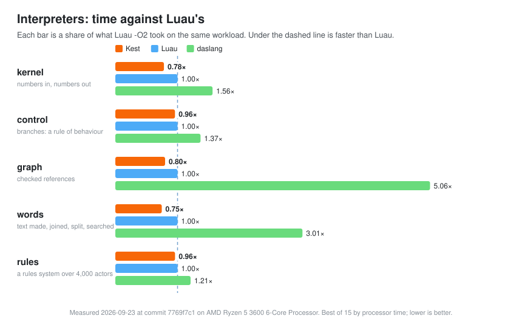
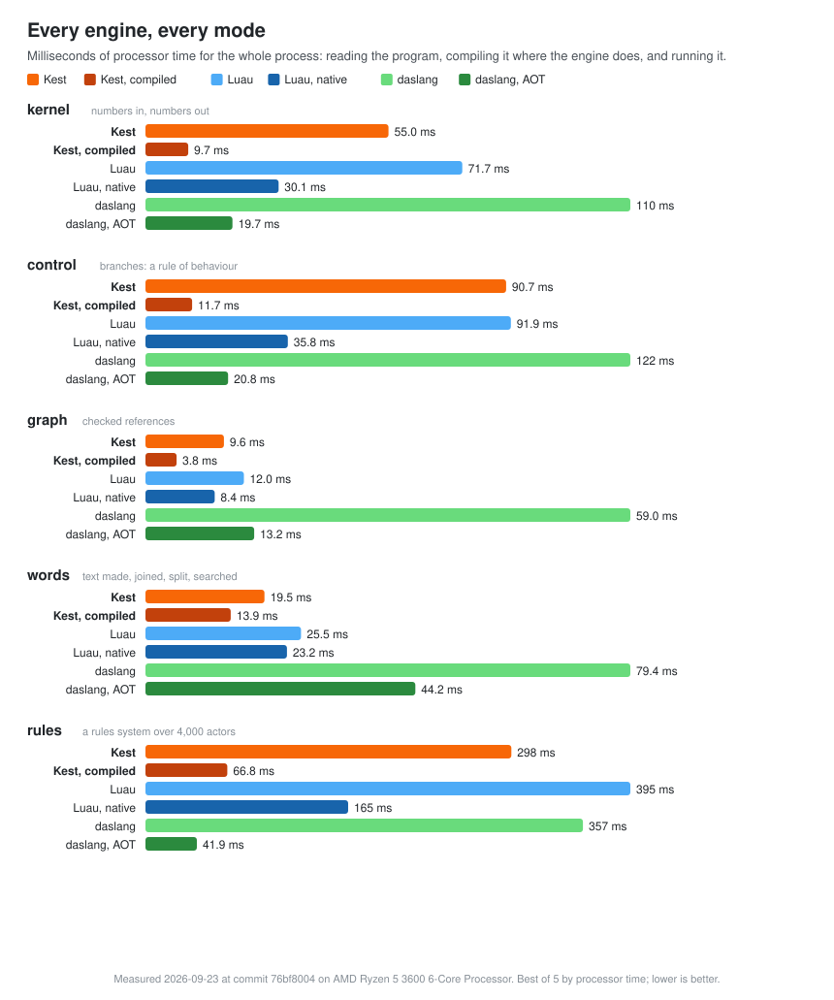

<div align="center">

# Kest

**A small, fast, statically typed language for the gameplay half of a game.**

A bytecode machine your engine embeds, written in C11 with nothing beneath it
but libc — and a compiler that proves what your code promises before it ever
runs.

[](https://github.com/Rawframe-Project/kest/actions/workflows/ci.yml)
[](LICENSE)


[Quick start](#quick-start) ·
[Why Kest](#why-kest) ·
[Performance](#performance) ·
[Embedding](#embedding-it) ·
[The language](docs/language.md) ·
[Primer](docs/primer.md) ·
[Book](docs/book.md)

</div>

---

```kest
module quest

import std.io

enum Task {
    Idle
    Fetch(i32)
    Wait(i32)
}

struct Actor {
    name: text
    hp: i32
    task: Task
}

// The compiler proves both promises: nothing here touches the heap, and
// it answers the same on every machine.
fn next(one: Actor) -> Task no.alloc deterministic {
    return match one.task {
        Idle -> if one.hp < 50 -> Task.Wait(3) else -> Task.Fetch(1)
        Fetch(item) -> Task.Wait(item + 1)
        Wait(left) -> if left <= 1 -> Task.Idle else -> Task.Wait(left - 1)
    }
}

fn main() -> i32 {
    let world: store<Actor> = store(16)
    let hero = add(world, Actor("Ada", 80, Task.Idle))
    for turn in 0..5 {
        if let one = get(world, hero) {
            one.task = next(one)
            set(world, hero, one)
            io.print("turn {turn}: {one.name} is {one.task}")
        }
    }
    return 0
}
```

```text
$ kest run quest.kest
turn 0: Ada is Task.Fetch(1)
turn 1: Ada is Task.Wait(2)
turn 2: Ada is Task.Wait(1)
turn 3: Ada is Task.Idle
turn 4: Ada is Task.Fetch(1)
```

## Why Kest

Kest sits where Luau, daslang, Lua, AngelScript and Quirrel sit: inside a
native engine, running the rules, the AI, the quests and the simulation a
designer changes every day. What it brings to that seat:

- **⚡ Fast where a frame is spent.** A stack-based bytecode machine with
  fused instructions, and a second engine that writes your program as C for a
  release build. Its interpreter is faster than Luau's on all five
  workloads below, and its compiled engine beats Luau's native code on every
  one.
- **🛡️ Promises the compiler proves.** `no.alloc` — this body never touches the
  heap. `no.host` — it never calls into the engine. `deterministic` — it
  answers the same bits on every machine, which is what lockstep and replays
  need. They are checked over every body a function reaches, not trusted.
- **🔗 Identity that cannot dangle.** `store<T>` hands out `ref<T>`, a
  reference the machine checks: one to something that was removed is refused
  at the line that used it, instead of quietly reading whatever took its
  place.
- **🩺 Diagnostics written for a person and for a model.** Every mistake in a
  file in one pass, each with a stable code, the place, a fix where one is
  known, and `--json` for tools and AI agents.
- **📐 One form.** `kest fmt` is the only way a file is laid out, so a diff is
  what changed and never how somebody likes their braces.
- **🔌 Made to be embedded.** One header, one static library, no allocator or
  thread you did not hand it. Four ceilings a host sets — stack, call depth,
  heap, and a budget of steps — each refused in words at the instruction that
  crossed it.
- **📦 One command to ship.** `kest build --release game.kest` writes a single
  binary that carries the program and runs with no source beside it.

## Performance

Five workloads, each written in Kest, Luau and daslang to answer the same
checksum, and run by every engine in every mode it ships.

<p align="center">
  
</p>

<p align="center">
  
</p>

> **Measured on 2026-09-23 at commit
> [`7769f7c1`](https://github.com/Rawframe-Project/kest/commit/7769f7c1),**
> on an AMD Ryzen 5 3600 running Linux: Kest 0.0.1, Luau `-O2` and
> `--codegen`, and daslang both interpreted and compiled ahead of time with
> `-exe`. Best of fifteen by processor time for the whole process, the runs
> of every row spread through the sitting rather than taken together, on a
> machine with a load of four; lower is better. The raw numbers, with
> the instructions each run retired, are in
> [bench/results.tsv](bench/results.tsv).

How to read it, honestly:

- **Interpreters.** On the clock Kest's is ahead of Luau's on all five — by
  4% on `control` and `rules` and 20 to 25% on the other three — and it
  retires fewer instructions than Luau's on all five, from 0.66× on `kernel`
  to 0.83× on `rules`. `control` and `rules` are close enough that a busy
  machine can turn them round. Against daslang's interpreter it is ahead
  everywhere.
- **Compiled.** Kest's release engine is ahead of Luau's native code on all
  five, by 1.7 to 3.8×, and ahead of daslang's AOT on four. daslang's AOT
  still wins `rules`, by about 1.2×.
- **Reproduce it** on your own machine with
  `KEST_LUAU=path/to/luau KEST_DAS=path/to/daslang sh bench/compare.sh`,
  which rewrites the table and both charts and stamps them with the date and
  the commit. Every workload is in [bench](bench), beside its Luau and daslang
  twins.

## Caught before it runs

A broken promise is reported where it breaks, with every place that breaks
it and the line that made the promise:

```text
$ kest check broken.kest
error[K0401]: this allocates, and `broken.step` promises `no.alloc`
  --> broken.kest:13:9
   |
13 |         push(log, "moved {i}")
   |         ^^^^^^^^^^^^^^^^^^^^^^ `push` grows what it is given
  --> broken.kest:13:19
   |
13 |         push(log, "moved {i}")
   |                   ^^^^^^^^^^^ and here: text with a hole in it is built, and what is built is on the heap
  --> broken.kest:8:4
   |
 8 | fn step(world: [Body], log: [text]) no.alloc {
   |    ^^^^ `broken.step` promises it here
```

And the everyday mistakes come back all at once, each with the fix:

```text
$ kest check typo.kest
warning[K0512]: nothing in this body reads `health`
 --> typo.kest:8:9
  |
8 |     let health = 100
  |         ^^^^^^ take it out: a local is a name for a value in one body, and one nothing reads is a value nobody asked for

error[K0306]: unknown name `damge`
 --> typo.kest:9:12
  |
9 |     return damge(helth, 10)
  |            ^^^^^ did you mean `damage`?

error[K0306]: unknown name `helth`
 --> typo.kest:9:18
  |
9 |     return damge(helth, 10)
  |                  ^^^^^ did you mean `health`?
```

## Quick start

All it needs is a C compiler.

```
make
./kest run examples/math.kest
make fast
```

A project from nothing:

```
kest new game
cd game
kest build
kest run
kest test tests/*.kest
```

`kest doctor` says what this command line is and where it looks for the
standard library, which is the first thing to run when something is off.

On Windows the build is `tools\build.bat` from a Developer Command Prompt, and
everything after that runs the same with `build\win\kest.exe`.

## Embedding it

A host is a few lines: build a program, start a machine, call into it.

```kest
module rules

fn damage(hp: i32, hit: i32, armour: i32) -> i32 no.alloc deterministic {
    let taken = hit - armour
    if taken < 1 {
        return hp - 1
    }
    return hp - taken
}
```

```c
#include <kest.h>
#include <stdio.h>

int main(void) {
    KestBuild *build = kest_build("rules.kest", NULL, stderr, KEST_FORM_TEXT, 0);
    KestRuntime *vm = build ? kest_start(build, NULL, NULL) : NULL;
    if (vm == NULL) {
        return 1;
    }
    int32_t damage = kest_entry(vm, "damage");
    KestValue frame[4] = {{.integer = 80}, {.integer = 25}, {.integer = 5}};
    if (kest_call(vm, damage, frame, 4)) {
        printf("hp left: %lld\n", (long long)frame[0].integer);
    }
    kest_runtime_free(vm);
    kest_build_free(build);
    return 0;
}
```

```text
$ cc -std=c11 -Iinclude host.c libkest.a -lm && ./a.out
hp left: 60
```

Two hosts in this tree show the rest. `examples/engine.c` is shaped like an
engine: it keeps a world between frames, lends the program its own memory a
frame at a time, and reloads the program under a world it saved
(`make engine && ./examples/engine`). `examples/embed.c` asks every door the
library has, one after another (`make embed && ./examples/embed`).

## Tooling

| | |
| --- | --- |
| `kest lsp` | the language server, and it *is* the compiler: what an editor says about a file and what `kest check` says cannot differ. `editors/vscode` is the extension. |
| `kest fmt` | the one form a file has. |
| `kest profile` | what a run did, in counts: steps, calls of each body, crossings into the host, the heap. |
| `kest check --cost` | what the compiler proved about every body, and which promises each could make. |
| `kest debug` | breakpoints that cost a running machine nothing until they are hit. |
| `kest dap` | the same debugger for an editor, over the Debug Adapter Protocol: breakpoints in the gutter, the call stack, a frame's variables, stepping over, into and out. The VS Code extension starts it. |
| `kest emit --c` | the program written as C, which is what `--release` compiles. |

## Installing

```
make PREFIX=/usr/local
sudo make install PREFIX=/usr/local
```

That puts `kest`, `kest.h`, `libkest.a` and the standard library where another
project looks. The compiler looks for the library in four places, in this
order: `$KEST_LIB`, then `lib/` beside itself, which is where it is in a source
tree, then `../lib/kest/`, which is where installing puts it, and last where
the build it came from was told it would be put. `make uninstall` takes away
exactly what `make install` put there.

`make release` writes one archive with a checksum beside it — the command line,
the header, the library, the standard library, the VS Code extension and the
documents — and CI unpacks it into an empty directory on every commit and
builds a host against it.

## Status

Version 0.0.1. Unstable on purpose: this said `1.0.0` for a day in September
2026 and withdrew it, because nobody outside the project had written a program
in it yet. Nothing is frozen while it is `0.0.x`, and every break is a decision
in [docs/decisions.md](docs/decisions.md) that says what it replaced and why.

What is there today: whole numbers and floats at every width with defined
wrapping, `text`, structs, fixed runs, arrays, `store<T>` and `ref<T>`, enums
that carry values, sets of named bits, optionals, functions as values,
generics compiled a copy per type, `defer`, `match`, `scratch { }` working
memory the compiler proves nothing escapes; a bytecode VM of 217 instructions;
a C embedding API of 113 doors; a standard library of eleven modules written in
Kest; and CI that builds and runs every example on Linux x86-64 and arm64,
Windows and macOS, holding all four to the same bytes.

What it is not: a systems language, an engine, or a hard real-time system —
there is a collector, and its pause is measured and written down. **It is not
yet a sandbox for code that is trying to get out**; being one is what it is
being built toward, and [SECURITY.md](SECURITY.md) says the threat model, how
far each promise in it is kept today, and how to report a vulnerability. The
standard library is small, and the language has not yet had a game shipped on
it.

## Documents

- [docs/language.md](docs/language.md) — the reference, and the normative one.
- [docs/book.md](docs/book.md) — the short way in, a chapter a thing, every program in it run.
- [docs/primer.md](docs/primer.md) — one page for somebody who knows Lua or Rust.
- [docs/compact.md](docs/compact.md) — the whole language in one sitting, for a model or anybody in a hurry.
- [ARCHITECTURE.md](ARCHITECTURE.md) — how the compiler and the machine are built, a paragraph a module.
- [docs/decisions.md](docs/decisions.md) — every decision and why, with the measurements behind it.
- [CHANGELOG.md](CHANGELOG.md) — what a program written against the last version has to do.
- [docs/worklog.md](docs/worklog.md) — what was built, in order.

`make check` is the whole gate — every example under two builds and the
sanitisers, every command against every file, and a sweep that breaks each of
the project's own checks on purpose to see it caught.

## Licence

[MIT](LICENSE).
